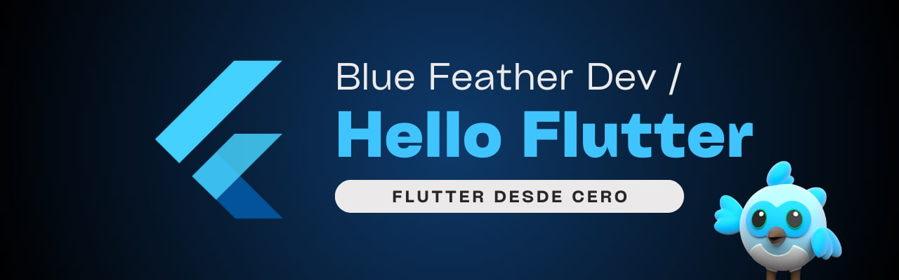

# Hello, Flutter! 

 

Este repositorio es mi espacio de estudio personal para aprender y practicar **Flutter**, paso a paso, con ejercicios académicos, documentación oficial, ejemplos y pruebas personales.

> Este repositorio está en constante crecimiento. Las carpetas se irán completando con ejemplos, notas y mejoras progresivamente.

## 🔎 ¿Qué encontrarás?  

### 👨‍💻 Aprendizaje estructurado 
- Widgets y layouts básicos (`Text`, `Image`, `Row`, `Column`, `Container`)  

- Manejo de estado y navegación (`Stateless`, `Stateful`, `route`)  
- Estilos, temas y recursos (`Material Design`, `theme`, `assets`) 
- Carpeta: [`learn-flutter/`](./learn-flutter/) 
  
### 🧪 Pruebas personales  
- Mis pruebas libres con Flutter. 
 
- Experimentos, prototipos y mini proyectos propios.  
- Carpeta: [`playground/`](./playground/)  

### 🥇 Codelabs oficiales  
- Ejemplos prácticos de Google sobre **Flutter**.  

- Guías adaptadas y comentadas.  
- Carpeta: [`codelabs/`](./codelabs/)  

### 🌐 Ejemplos destacados  
- Ejemplos de la comunidad que me han parecido útiles o inspiradores. 
 
- Código adaptado para mi aprendizaje personal.  
- Carpeta: [`examples/`](./examples/)

### 🎓 Aprendizaje en la universidad  
- Ejercicios académicos y prácticas relacionadas con las clases.  

- Proyectos guiados y notas adicionales.  
- Carpeta: [`universidad-de-la-costa/`](./universidad-de-la-costa/)  

## 🎯 Objetivos del repositorio  

- Consolidar mi conocimiento de **Flutter** a partir de la práctica.
  
- Crear una base sólida para futuros proyectos de desarrollo móvil.  
- Documentar mi progreso en el aprendizaje paso a paso.  

## ⚖️ Licencia del repositorio

Este proyecto está licenciado bajo los términos de la [Licencia Apache 2.0](LICENSE).

> Made with '\u{2665}' (♥) by Jesús Domínguez [@bluefeatherdev](https://github.com/bluefeatherdev/)
