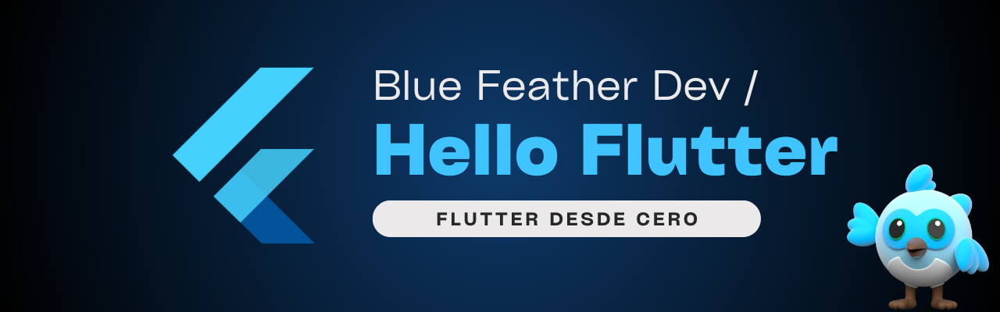

# Hello, Flutter! 

 

Este repositorio es mi espacio de estudio personal para aprender y practicar **Flutter**, paso a paso, con ejercicios académicos, documentación oficial, ejemplos y pruebas personales.

> Este repositorio está en constante crecimiento. Las carpetas se irán completando con ejemplos, notas y mejoras progresivamente.

## 🔎 ¿Qué encontrarás?

### 🎓 Aprendizaje en la universidad  
- Ejercicios académicos y prácticas relacionadas con las clases.  

- Proyectos guiados y notas adicionales.  
- Carpeta: [`cuc/`](./cuc/)    

### 🧪 Playground personal  
- Mis pruebas libres con Flutter. 
 
- Experimentos, prototipos y mini proyectos propios.  
- Carpeta: [`playground/`](./playground/)  

### 🌐 Documentación oficial  
- Ejercicios y ejemplos basados directamente en la documentación de **Flutter**.  

- Guías adaptadas y comentadas.  
- Carpeta: [`docs/`](./docs/)  

### 🥇 Ejemplos destacados  
- Ejemplos de la comunidad que me han parecido útiles o inspiradores. 
 
- Código adaptado para mi aprendizaje personal.  
- Carpeta: [`examples/`](./examples/)

## 🎯 Objetivos del repositorio  

- Consolidar mi conocimiento de **Flutter** a partir de la práctica.
  
- Crear una base sólida para futuros proyectos de desarrollo móvil.  
- Documentar mi progreso en el aprendizaje paso a paso.  

> Made with '\u{2665}' (♥)
